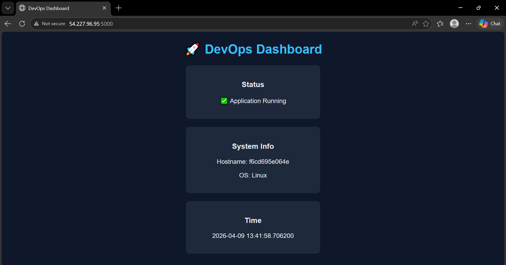
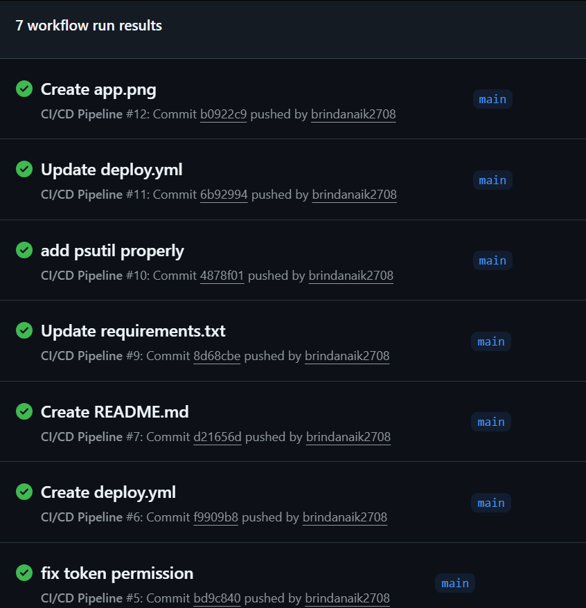
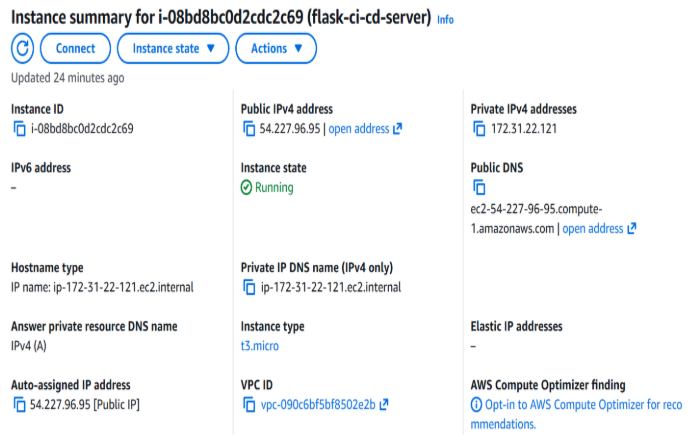

# Flask CI/CD Deployment on AWS EC2

End-to-end deployment of a containerized Flask application using an automated CI/CD pipeline. Every commit triggers a build, pushes a Docker image, and deploys it to a live AWS EC2 instance.

## Live Application

http://54.227.96.95:5000

## Technology Stack

* Flask (Python)
* Docker
* AWS EC2 (Amazon Linux)
* GitHub Actions
* Linux (SSH)

## Key Features

* Containerized Flask application
* Automated CI/CD pipeline on every push
* Zero-manual deployment to EC2
* Publicly accessible live endpoint
* Secure SSH-based deployment

## Architecture

GitHub → GitHub Actions → Docker Hub → AWS EC2 → Running Container

## CI/CD Workflow

1. Push code to main branch
2. GitHub Actions builds Docker image
3. Image pushed to Docker Hub
4. EC2 pulls latest image
5. Existing container stopped and removed
6. New container deployed

## Docker Commands

Build image:

```bash
docker build -t brindanaik2708/flask-app .
```

Run container:

```bash
docker run -d -p 5000:5000 brindanaik2708/flask-app
```

## AWS EC2 Configuration

* Instance: t3.micro (Free Tier)
* OS: Amazon Linux 2023
* Ports:

  * 22 (SSH)
  * 5000 (App)

## Environment Variables

* EC2_HOST
* EC2_USER
* EC2_KEY
* DOCKER_USERNAME
* DOCKER_PASSWORD

## Screenshots

Live Application


CI/CD Pipeline


EC2 Instance


## Future Improvements

* Custom domain with HTTPS
* Nginx reverse proxy
* Monitoring & logging
* Kubernetes deployment

## Author

Brinda Naik
